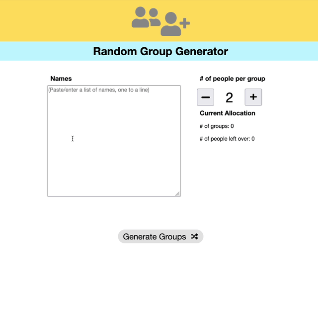

# Random Group Generator

This is an update of [GroupGenerator](https://github.com/togarci/GroupGenerator) - thank you [togarci](https://github.com/togarci) - a simple HTML/Javascript page that enables you to 

1. Provide a list of names.
2. Choose the number of groups to create.
3. Randomly allocate names to groups.

[Use it here](https://djplaner.github.io/GroupGenerator/) or see an [animated screenshot below](#about).

## Changes to the original

- Speeding up the addition/removal of names.

    Use a textarea to allow copy and pasting of and subsequent quick editing of names. One name per line.

- Add the ability save and load one group allocation.

    A group allocation is saved to the current browser on the current computer. Enabling you to save the current allocation, navigate away from the generator, return to it later, and reload the saved allocation.

- Showing the _current allocation_.

    As you add names or change the number of groups automatically display the new number of groups and number of people left over (e.g. if there are 5 names and group size is 2, there will be 2 groups of 2 with 1 person "left over").

- Some minor layout/HTML/CSS changes.

    Some required for new elements, a bug or two, and some cosmetic.

- Translated original Spanish text to English.

- Updated the animated GIF screenshots below.

## About

This web page was created thought to help students to generate Random groups between friends. But it can be used for anyone that wanna to generate random groups. To that it is very simple, you just input the members and choose number of the people by group and then the system do the rest.

## To do

- [x] Add the ability to save group allocations to allow for later retrieval - use local storage
- [ ] Make the application more responsive.

    Primarily to allow effective use in a classroom on a data projector.

    - [ ] In particular, the display of student names in groups.
